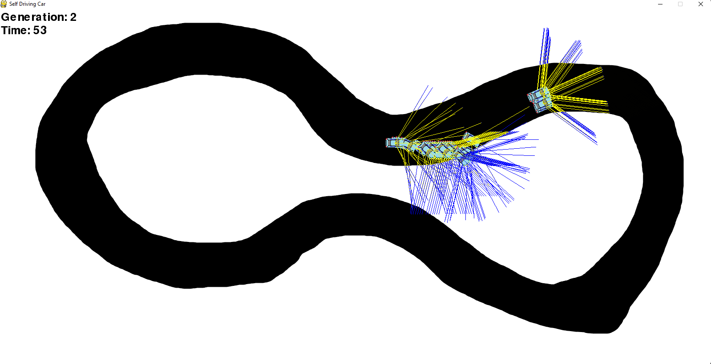

# Self Driving Car Using Random Mutations
This is an example of Reinforcement Learning model training without gradients. This implementation mainly uses Numpy and PyGame.


The program mainly has three different modes, which can be selected by changing the GAME_MODE parameter in the [Configuration](configs.py) file.
* TRAIN : Populates many cars with sensors that try to finish the track and keep improving each generation.
* SELFDRIVING : Populates a single car with sensors that is controlled by the best model found by training.
* KEYBOARD : Populates a single car controllable with a keyboard.

# Usage

1. Create a new environment
```
conda env create --name envname --file=environments.yml
```
2. Change the values in the [Configuration](configs.py) file, or keep it as it is for the default mode.
3. Run the main.py file.
```
python main.py
```


